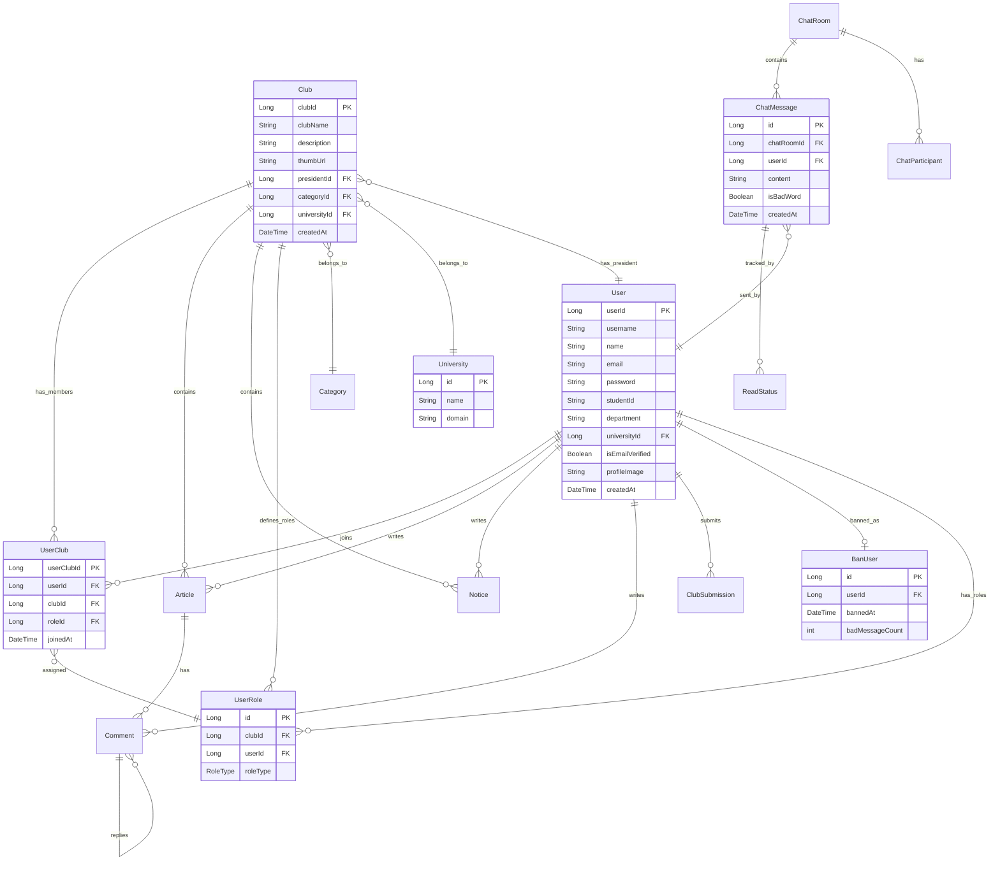

# 🎓 ClubMoa - 동아리 통합 플랫폼

> 동아리 모집·지원 과정의 불편함을 해소하고, 실시간 채팅과 다양한 기능으로 동아리 운영자와 지원자 간 소통을 돕는 웹 애플리케이션

---

## 📌 목차

- [프로젝트 소개](#-프로젝트-소개)
- [팀원 소개](#-팀원-소개)
- [기술 스택](#️-기술-스택)
- [시스템 아키텍처](#-시스템-아키텍처)
- [주요 기능](#-주요-기능)
- [프로젝트 구조](#-프로젝트-구조)
- [시작하기](#-시작하기)
- [환경 설정](#️-환경-설정)
- [API 개요](#-api-개요)
- [배포](#-배포)
- [DB 스키마](#-db-스키마)

---

## 📌 프로젝트 소개

**ClubMoa**는 대학교 동아리의 모집·지원·운영을 하나의 플랫폼에서 관리할 수 있도록 개발된 풀스택 웹 애플리케이션입니다.

기존의 번거로운 동아리 가입 절차와 분산된 소통 채널 문제를 해결하기 위해, **실시간 채팅(WebSocket/STOMP)**, **역할 기반 권한 관리**, **비속어 필터링** 등의 기능을 제공합니다. 동아리 운영진은 지원서를 체계적으로 관리하고, 지원자는 간편하게 동아리를 탐색·가입할 수 있습니다.

---

## 👥 팀원 소개

| Chaehyunli | DOOYEE0709 | Youcu | dongba |
|:---:|:---:|:---:|:---:|
|  |  |  | |
| [@Chaehyunli](https://github.com/Chaehyunli) | [@DOOYEE0709](https://github.com/DOOYEE0709) | [@Youcu](https://github.com/Youcu) | dongba |

---

## 🛠️ 기술 스택

### Backend

| 기술 | 버전 | 설명 |
|------|------|------|
|  | 17 (LTS) | 메인 언어 |
|  | 3.4.1 | 웹 프레임워크 |
|  | Starter | 인증 · 인가 |
| -Starter-6DB33F?style=flat-square&logo=Hibernate&logoColor=white) | Starter | ORM |
|  | Starter | 실시간 채팅 |
|  | Starter | 세션 · 캐시 · Pub/Sub |
|  | Starter | 이메일 템플릿 |
|  | 2.7.0 | API 문서화 |
|  | 2.28.0 | 파일 업로드 |
|  | Latest | 보일러플레이트 제거 |
|  | 3.0.5 | 로컬 캐싱 |

### Frontend

| 기술 | 버전 | 설명 |
|------|------|------|
|  | 18.2.0 | UI 라이브러리 |
|  | ES6+ | 메인 언어 |
|  | 7.1.5 | 라우팅 |
|  | 3.x | 스타일링 |
|  | 1.7.9 | HTTP 클라이언트 |
|  | 1.6.1 | WebSocket 폴백 |
|  | 1.2.6 | STOMP 메시징 |
|  | 1.11.13 | 날짜 처리 |
|  | 5.4.0 | 아이콘 라이브러리 |

### Database & Infra

| 기술 | 설명 |
|------|------|
|  | 메인 데이터베이스 |
|  | 세션 저장 · 실시간 메시징 Pub/Sub |
|  | 컨테이너화 |
|  | 리버스 프록시 |
|  | Cloud SQL · Cloud Storage |

### Tools

| Development | Design | Project Management |
|:---:|:---:|:---:|
|   |  |   |
|  | | |

---

## 🏗 시스템 아키텍처

```
┌──────────────────────────────────────────────────────────────┐
│                        Client (Browser)                       │
│                     React 18 + Tailwind CSS                   │
└──────────────────────────┬───────────────────────────────────┘
                           │ HTTP / WebSocket
┌──────────────────────────┼───────────────────────────────────┐
│                    Nginx Reverse Proxy                        │
│             /  →  React Static Files                         │
│          /api/*  →  Spring Boot (Port 8080)                  │
└──────────────────────────┬───────────────────────────────────┘
                           │
┌──────────────────────────┼───────────────────────────────────┐
│              Spring Boot Application (Port 8080)              │
│                                                               │
│  ┌─────────────┐  ┌─────────────┐  ┌──────────────────────┐ │
│  │ Controllers  │  │  Services   │  │   Repositories (JPA) │ │
│  │ (REST API)   │→│ (비즈니스    │→│   (데이터 접근)       │ │
│  │ + WebSocket  │  │  로직)      │  │                      │ │
│  └─────────────┘  └─────────────┘  └──────────────────────┘ │
└───────────┬──────────────┬───────────────────────────────────┘
            │              │
   ┌────────┴────────┐  ┌─┴──────────────┐  ┌─────────────────┐
   │  MySQL (GCP)    │  │  Redis          │  │  GCP Cloud      │
   │  메인 DB        │  │  세션 · Pub/Sub │  │  Storage (파일) │
   └─────────────────┘  └────────────────┘  └─────────────────┘
```

---

## ✨ 주요 기능

### 🔐 인증 · 인가
- 대학교 이메일 인증 기반 회원가입
- Spring Security 세션 인증 (90분 타임아웃)
- 비밀번호 재설정 (이메일 토큰)
- 아이디 찾기
- 회원 탈퇴

### 👤 유저 관리
- 프로필 조회 · 수정 · 프로필 이미지 초기화
- 유저 밴 시스템 (BanUser)

### 🏠 동아리 관리
- 동아리 생성 · 삭제 · 썸네일 수정
- 카테고리별 동아리 탐색 및 검색
- 동아리 게시판 (게시글 · 공지사항 · 대댓글)
- 동아리 상세 페이지 (멤버 목록, 모집 현황)

### 📋 가입 · 지원 시스템
- 동아리 지원서 작성 · 수정 · 삭제
- 운영진의 지원서 검토 · 승인 · 반려
- 역할 기반 권한 관리 (회장 · 부회장 · 운영진 · 일반 회원)
- 회원 관리 (강퇴, 밴)

### 💬 실시간 채팅
- WebSocket(STOMP) + SockJS 기반 실시간 메시징
- 그룹 채팅 · 1:1 개인 채팅 지원
- Redis Pub/Sub를 통한 다중 인스턴스 메시지 동기화
- 채팅방 관리 (참여자 목록, 읽음 상태 추적)

### 🛡️ 콘텐츠 관리
- Aho-Corasick 알고리즘 기반 비속어 필터링
- 허용 단어 화이트리스트 지원
- 텍스트 정규화 처리

### 📁 파일 업로드
- Google Cloud Storage Presigned URL 기반 이미지 업로드
- 파일 크기 제한 (10MB/파일, 15MB/요청)

---

## 📂 프로젝트 구조

```
ClubMoa/
├── frontend/                              # 🖥️ React Frontend
│   ├── public/                           # 정적 리소스
│   │   ├── index.html                   #   HTML 엔트리포인트
│   │   ├── favicon.ico                  #   파비콘
│   │   ├── banner.png                   #   배너 이미지
│   │   ├── manifest.json               #   PWA 매니페스트
│   │   └── robots.txt                   #   크롤러 설정
│   ├── src/
│   │   ├── api/                          # API 클라이언트 모듈
│   │   │   ├── api.js                   #   API Base URL 상수 정의
│   │   │   ├── authApi.js               #   인증 API
│   │   │   ├── clubApi.js               #   동아리 API
│   │   │   ├── chatApi.js               #   채팅 API
│   │   │   ├── categoryApi.js           #   카테고리 API
│   │   │   ├── commentApi.js            #   댓글 API
│   │   │   ├── userApi.js               #   유저 API
│   │   │   └── uploadApi.js             #   파일 업로드 API
│   │   ├── assets/                       # 이미지 · 아이콘 리소스
│   │   ├── components/                   # 공통 UI 컴포넌트 (39개)
│   │   ├── context/                      # React Context
│   │   │   ├── AuthContext.js           #   인증 상태 관리
│   │   │   └── ChatContext.js           #   채팅 상태 관리
│   │   ├── layouts/                      # 레이아웃 컴포넌트
│   │   │   └── ChatLayout.js            #   채팅 레이아웃
│   │   ├── pages/                        # 페이지 컴포넌트 (23개)
│   │   ├── constants/                    # 상수 정의
│   │   │   └── DefaultImage.js          #   기본 이미지 상수
│   │   └── App.js                        # 앱 진입점
│   ├── .env.development                  # 개발 환경 변수
│   ├── .env.production                   # 운영 환경 변수
│   ├── Dockerfile                        # 프론트엔드 Docker 이미지
│   ├── tailwind.config.js                # Tailwind CSS 설정
│   ├── postcss.config.js                 # PostCSS 설정
│   └── package.json
│
├── src/                                   # ☕ Spring Boot Backend
│   ├── main/java/com/example/teamproject2025/
│   │   ├── TeamProject2025Application.java  # Spring Boot 메인 클래스
│   │   ├── config/                       # 설정 클래스 (11개)
│   │   │   ├── SecurityConfig.java      #   Spring Security 설정
│   │   │   ├── RedisConfig.java         #   Redis 설정
│   │   │   ├── SessionConfig.java       #   세션 관리 설정
│   │   │   ├── SessionAuthenticationFilter.java  # 세션 인증 필터
│   │   │   ├── StompWebSocketConfig.java #  WebSocket/STOMP 설정
│   │   │   ├── StompHandler.java        #   STOMP 메시지 핸들러
│   │   │   ├── StompEventListener.java  #   STOMP 이벤트 리스너
│   │   │   ├── GcpStorageConfig.java    #   GCP Storage 설정
│   │   │   ├── ProfanityConfig.java     #   비속어 필터 설정
│   │   │   ├── SwaggerConfig.java       #   Swagger 설정
│   │   │   └── WebConfig.java           #   Web(CORS) 설정
│   │   ├── controller/                   # API 컨트롤러
│   │   │   ├── Auth/                    #   인증 (로그인 · 회원가입)
│   │   │   ├── Chat/                    #   채팅 · WebSocket
│   │   │   ├── Club/                    #   동아리 · 게시글 · 공지
│   │   │   ├── Common/                  #   공통 응답 처리
│   │   │   ├── Membership/             #   가입 · 역할 관리
│   │   │   ├── Upload/                  #   파일 업로드
│   │   │   └── User/                    #   유저 프로필
│   │   ├── service/                      # 비즈니스 로직
│   │   │   ├── Auth/                    #   인증 · 이메일 인증
│   │   │   ├── Chat/                    #   채팅 · Redis Pub/Sub
│   │   │   ├── Club/                    #   동아리 운영
│   │   │   ├── Membership/             #   멤버십 · 권한
│   │   │   ├── ProfanityFilter/        #   비속어 필터링
│   │   │   └── User/                    #   유저 관리
│   │   ├── entity/                       # JPA 엔티티
│   │   │   ├── Chat/                    #   ChatRoom, ChatMessage, ChatParticipant, ReadStatus
│   │   │   ├── Club/                    #   Club, Article, Notice, Comment, Category
│   │   │   ├── Membership/             #   UserClub, ClubSubmission, UserRole, RoleType
│   │   │   ├── University/             #   University
│   │   │   └── User/                    #   User, BanUser
│   │   ├── dto/                          # 요청 · 응답 DTO
│   │   │   ├── Auth/                    #   인증 관련 DTO
│   │   │   ├── Chat/                    #   채팅 관련 DTO
│   │   │   ├── Club/                    #   동아리 관련 DTO
│   │   │   ├── Common/                  #   공통 응답 DTO
│   │   │   ├── Membership/             #   멤버십 관련 DTO
│   │   │   └── User/                    #   유저 관련 DTO
│   │   ├── repository/                   # JPA Repository
│   │   │   ├── Auth/                    #   인증 관련
│   │   │   ├── Chat/                    #   채팅 관련
│   │   │   ├── Club/                    #   동아리 관련
│   │   │   ├── Membership/             #   멤버십 관련
│   │   │   ├── University/             #   대학교 관련
│   │   │   └── User/                    #   유저 관련
│   │   ├── exception/                    # 전역 예외 처리
│   │   ├── constant/                     # 상수 정의
│   │   │   └── DefaultImage.java        #   기본 이미지 상수
│   │   └── web/                          # 웹 컨트롤러
│   │       └── ReactRestController.java #   React SPA 라우팅 지원
│   │
│   ├── main/resources/
│   │   ├── application.properties       # 기본 설정
│   │   ├── application-dev.properties   # 개발 환경
│   │   ├── application-prod.properties  # 운영 환경
│   │   ├── templates/                    # 이메일 인증 템플릿
│   │   ├── data.sql                      # 초기 데이터 시드
│   │   ├── merged_badwords.json         # 비속어 사전
│   │   ├── allowed_words.json           # 허용 단어 화이트리스트
│   │   ├── normalization_dict.json      # 텍스트 정규화 사전
│   │   └── univ_domains.json            # 대학교 도메인 데이터
│   │
│   └── test/                             # 테스트 코드
│
├── nginx/
│   └── nginx.conf                        # Nginx 리버스 프록시 설정
│
├── docker-compose.yml                    # Docker 멀티 컨테이너 구성
├── Dockerfile                            # 백엔드 Docker 이미지
├── build.gradle                          # Gradle 빌드 설정
├── settings.gradle                       # Gradle 프로젝트 설정
├── package.json                          # 루트 레벨 패키지 설정
└── cors.json                             # GCP Storage CORS 설정
```

---

## 🚀 시작하기

### 📋 Prerequisites

- **Java** 17 이상
- **Node.js** 18 이상 & npm
- **MySQL** 8.0 이상
- **Redis** 서버
- **Docker** & **Docker Compose** (컨테이너 배포 시)

### 1️⃣ 저장소 클론

```bash
git clone https://github.com/DOOYEE0709/ClubMoa.git
cd ClubMoa
```

### 2️⃣ Backend 실행 (Spring Boot)

```bash
# 환경 변수 설정 (application-dev.properties 참고)
# MySQL, Redis, SMTP 정보 입력 필요

# Mac/Linux
./gradlew bootRun

# Windows
gradlew.bat bootRun
```

- 기본 실행: `http://localhost:8080`
- Swagger API 문서: `http://localhost:8080/swagger-ui.html`

### 3️⃣ Frontend 실행 (React)

```bash
cd frontend
npm install       # 의존성 설치 (최초 1회)
npm start         # 개발 서버 실행
```

- 기본 실행: `http://localhost:3000`

### 4️⃣ Docker로 전체 실행

```bash
docker-compose up --build
```

| 서비스 | 포트 |
|--------|------|
| Frontend (React) | 3000 |
| Backend (Spring Boot) | 8080 |
| Nginx (Reverse Proxy) | 80, 443 |

---

## ⚙️ 환경 설정

### Backend (application-dev.properties)

```properties
# Database
spring.datasource.url=jdbc:mysql://localhost:3306/teamproject2025?useSSL=false&allowPublicKeyRetrieval=true&serverTimezone=UTC
spring.datasource.username=${DB_NAME}
spring.datasource.password=${DB_PWD}

# Redis
spring.data.redis.host=localhost
spring.data.redis.port=6379
spring.data.redis.password=${REDIS_PWD}

# Email (SMTP)
spring.mail.host=smtp.gmail.com
spring.mail.port=587
spring.mail.username=<GMAIL_ADDRESS>
spring.mail.password=${SMTP_PWD}

# GCP Cloud Storage
spring.cloud.gcp.storage.bucket=${GCP_BUCKET}
spring.cloud.gcp.storage.project-id=${GCP_PROJECT_ID}
spring.cloud.gcp.credentials.location=${GCP_CREDENTIALS_PATH}
```

### Frontend

```bash
# frontend/.env
REACT_APP_API_BASE_URL=http://localhost:8080
```

### Docker 환경 변수 (docker-compose.yml)

```yaml
backend:
  environment:
    - SPRING_PROFILES_ACTIVE=prod
    - DB_PWD=<DB_PASSWORD>
    - SMTP_PWD=<SMTP_PASSWORD>
    - GCP_BUCKET=<BUCKET_NAME>
    - GCP_PROJECT_ID=<PROJECT_ID>
    - GCP_CREDENTIALS_PATH=/app/credentials/service-key.json

frontend:
  environment:
    - REACT_APP_API_BASE_URL=http://<SERVER_IP>:8080
```

---

## 📡 API 개요

모든 API는 `/api/v1` 프리픽스 하위에 위치하며, Swagger UI(`/swagger-ui.html`)에서 상세 확인 가능합니다.

### Auth (`/api/v1/auth`)

| Method | Endpoint | 설명 |
|--------|----------|------|
| POST | `/login` | 로그인 |
| POST | `/logout` | 로그아웃 |
| GET | `/session` | 현재 세션 유저 정보 조회 |
| POST | `/email` | 인증 이메일 발송 |
| POST | `/email/verify` | 이메일 인증 확인 |
| POST | `/find-id` | 아이디 찾기 |
| POST | `/password-reset` | 비밀번호 재설정 |
| POST | `/univ-name` | 이메일 기반 대학교명 조회 |
| PUT | `/ban-user/{userId}` | 유저 밴 처리 |

### Users (`/api/v1/users`)

| Method | Endpoint | 설명 |
|--------|----------|------|
| POST | `/register` | 회원가입 |
| DELETE | `/` | 회원 탈퇴 |
| GET | `/list` | 전체 유저 목록 |
| GET | `/profile` | 내 프로필 조회 |
| PATCH | `/profile` | 프로필 수정 |
| GET | `/{userId}/profile` | 다른 유저 프로필 조회 |
| PATCH | `/profile/image/reset` | 프로필 이미지 초기화 |
| GET | `/submissions` | 내 지원서 목록 |
| GET | `/submissions/{applyId}` | 내 지원서 상세 |
| PATCH | `/submissions/{applyId}` | 내 지원서 수정 |
| DELETE | `/submissions/{applyId}` | 내 지원서 삭제 |

### Clubs (`/api/v1/clubs`)

| Method | Endpoint | 설명 |
|--------|----------|------|
| GET | `/` | 동아리 목록 조회 |
| POST | `/` | 동아리 생성 (multipart) |
| GET | `/{clubId}` | 동아리 상세 조회 |
| DELETE | `/{clubId}` | 동아리 삭제 |
| GET | `/{clubId}/role` | 동아리 내 본인 역할 조회 |
| GET | `/my-clubs` | 내 동아리 목록 |
| GET | `/search` | 동아리 검색 |
| PATCH | `/{clubId}/thumbnail` | 동아리 썸네일 수정 |
| PATCH | `/{clubId}/thumbnail/reset` | 동아리 썸네일 초기화 |

### Articles (`/api/v1/clubs/{clubId}/articles`)

| Method | Endpoint | 설명 |
|--------|----------|------|
| GET | `/` | 게시글 목록 |
| POST | `/` | 게시글 작성 |
| GET | `/{articleId}` | 게시글 상세 |
| PUT | `/{articleId}` | 게시글 수정 |
| DELETE | `/{articleId}` | 게시글 삭제 |

### Notices (`/api/v1/clubs/{clubId}/notices`)

| Method | Endpoint | 설명 |
|--------|----------|------|
| GET | `/` | 공지사항 목록 |
| POST | `/` | 공지사항 작성 |
| GET | `/{noticeId}` | 공지사항 상세 |
| PUT | `/{noticeId}` | 공지사항 수정 |
| DELETE | `/{noticeId}` | 공지사항 삭제 |

### Comments (`/api/v1/comment`)

| Method | Endpoint | 설명 |
|--------|----------|------|
| GET | `/articles/{articleId}/comments` | 댓글 목록 조회 |
| POST | `/articles/{articleId}` | 댓글 작성 |
| PATCH | `/articles/{commentId}` | 댓글 수정 |
| DELETE | `/articles/{commentId}` | 댓글 삭제 |

### Categories (`/api/v1/categories`)

| Method | Endpoint | 설명 |
|--------|----------|------|
| GET | `/` | 전체 카테고리 목록 |

### Membership (`/api/v1/clubs`)

| Method | Endpoint | 설명 |
|--------|----------|------|
| POST | `/{clubId}/submissions` | 동아리 지원 |
| GET | `/{clubId}/submissions` | 지원서 목록 조회 |
| GET | `/{clubId}/submissions/status` | 지원 상태 확인 |
| GET | `/{clubId}/submissions/{applyId}` | 지원서 상세 |
| PATCH | `/{clubId}/submissions/{applyId}/approve` | 지원 승인 |
| PATCH | `/{clubId}/submissions/{applyId}/reject` | 지원 반려 |
| GET | `/{clubId}/members` | 동아리 멤버 목록 |
| POST | `/grant-role` | 역할 부여 |
| DELETE | `/leave-club` | 멤버 강퇴 |

### Chat (`/api/v1/chat`)

| Method | Endpoint | 설명 |
|--------|----------|------|
| GET | `/my/rooms` | 내 채팅방 목록 |
| POST | `/room/group/create` | 그룹 채팅방 생성 |
| POST | `/room/private/create` | 1:1 채팅방 생성 |
| GET | `/room/group/list` | 그룹 채팅방 목록 |
| POST | `/room/group/{roomId}/join` | 그룹 채팅방 참여 |
| GET | `/history/{roomId}` | 메시지 내역 조회 |
| PATCH | `/room/{roomId}/read` | 메시지 읽음 처리 |
| DELETE | `/room/group/{roomId}/leave` | 그룹 채팅방 나가기 |
| DELETE | `/room/private/{roomId}/leave` | 1:1 채팅방 나가기 |
| GET | `/room/{roomId}/participants` | 참여자 목록 |
| GET | `/room/{roomId}/name` | 채팅방 이름 조회 |
| WebSocket | `/connect` (STOMP) | 실시간 메시지 송수신 |

### Upload (`/api/v1/upload`)

| Method | Endpoint | 설명 |
|--------|----------|------|
| GET | `/presigned-url` | 업로드용 Presigned URL 발급 |
| GET | `/presigned-url/download` | 다운로드용 Presigned URL 발급 |

> 📖 전체 API 명세는 서버 실행 후 `http://localhost:8080/swagger-ui.html`에서 확인하세요.

---

## 🐳 배포

### Docker Compose 구성

```
┌─────────────────────────────────────────┐
│              Docker Network              │
│                                          │
│  ┌────────────┐  ┌──────────────────┐  │
│  │  react-    │  │  spring-         │  │
│  │  frontend  │  │  backend         │  │
│  │  :3000     │  │  :8080           │  │
│  └─────┬──────┘  └────────┬─────────┘  │
│        │                   │            │
│  ┌─────┴───────────────────┴─────────┐  │
│  │         nginx-proxy               │  │
│  │         :80 / :443                │  │
│  └───────────────────────────────────┘  │
└─────────────────────────────────────────┘
```

```bash
# 빌드 및 실행
docker-compose up --build -d

# 로그 확인
docker-compose logs -f

# 종료
docker-compose down
```

### GCP 인프라

| 서비스 | 용도 |
|--------|------|
| Cloud SQL (MySQL) | 메인 데이터베이스 |
| Cloud Storage | 이미지 · 파일 저장소 |
| Memorystore (Redis) | 세션 · 캐시 · Pub/Sub |

---

## 📄 DB 스키마



---

**ClubMoa** - 대학 동아리의 모집부터 운영까지, 하나의 플랫폼에서 🎓
